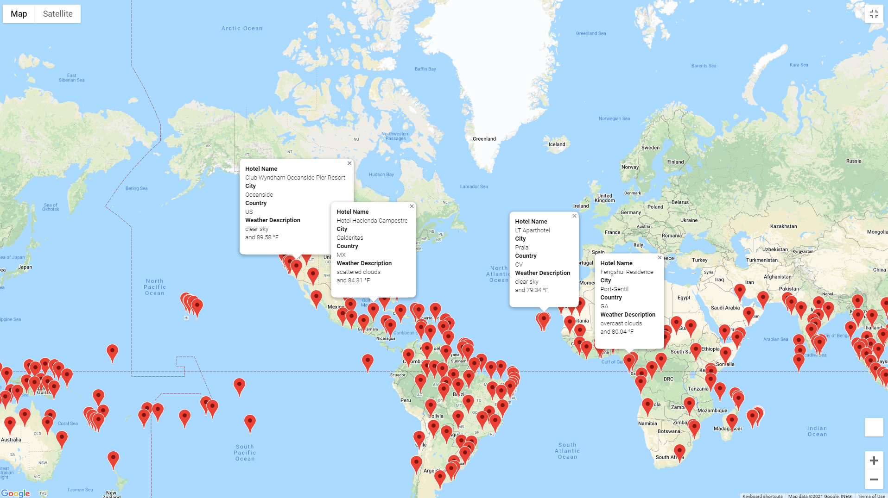
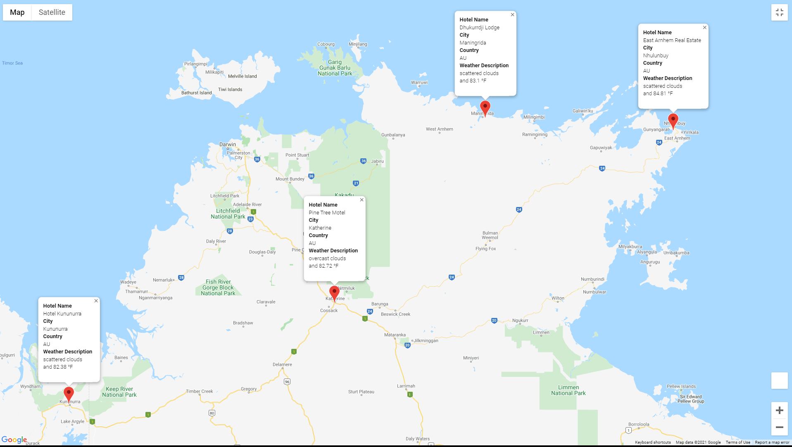

# A Thorough Analysis of World Weather Trends And Sample Vacation Planning

## **Overview**:
This analysis was conducted in three parts, which included:
  1. The creation of a weather database - links to files: *CSV Data Sheet* [WeatherPy_Database](Weather_Database/WeatherPy_Database.csv)
  2. Narrowing-down of locations in the database to create a vacation plan - links to files: *CSV Data Sheet* [WeatherPy_vacation](Vacation_Search/WeatherPy_vacation.csv)
  3. Establishing a potential vacation itinerary for a theoretical customer's preferences - link to file: *Jupyter Notebook File* [Vacation_Itinerary](Vacation_Itinerary/Vacation_Itinerary.ipynb)
Using the random modules in Python to create functions that generated random sets of Latitude and Longitude map points, a list of over 700 locations was narrowed down with increasing filtration in each part of this analysis. With the help of the Open Weather Map API and the Gmaps plugin to access the Google Maps API, various map images were created to display the data in a visual format that is easy to quickly understand and compares a collection of criteria about each geographical location provided by the Latitudinal and Longitudinal pairs. 

## **Analysis**:
The bulk of the data analysis was done through Jupyter Notebook in Python with the Pandas library tools and the resulting dataframes were exported as CSV files once their respective parts in the project were completed. A closer look at the way the data was collected and filtered is included below.
### *Weather Database*:
For the first step in gathering the data, a sample size of 2,000 individual latitudinal and longitudinal values were generated with the random module and were paired up to create geographical points across the world. With these points in a list, they were sorted through based on the closest city with the help of the citipy module, and any points that were not within range of a city were dropped. Then, the database was created by iterating through the list of cities in the Open Weather Map API and gathering all weather information related to each city. The resulting dataframe was exported to a CSV file and is linked to in the Overview section above.

### *Vacation Search*:
With the available database from the previous section, the data was narrowed down to preferable climates for vacations by limiting the minimum and maximum temperatures gathered for each location between 70 and 90 degrees Fahrenheit. These climates would be the most comfortable for the average customers who would be seeking locations to go to for a vacation and greatly reduced the list of locations to be considered for the remainder of the analysis. With the help of the Google Maps API, a cleaned dataframe containing the locations that fit the climate preferences was used to mark points on a map for hotel locations close to the remaining cities in the dataframe. The map is included below and each marker contains the relevant information for the closest hotel in each city, with the map being included in the code of the Jupyter Notebook file linked to below.
#### **Vacation Locations With Temperatures Between 70 and 90 F**:

#### Jupyter Notebook File:
[WeatherPy_vacation](Vacation_Search/Vacation_Search.ipynb)

### *Vacation Itinerary*:
Finally, based on the points populated on the map from the previous part of the analysis, a collection of 4 somewhat-closely grouped points were considered for a theoretical vacation and an itinerary was planned out based on these points. The locations were grouped in the northern point of Australia's Northern Territory and primarily were located in the more lush parts of the Australian territory. With further help from Google's Directions API a route was mapped out for these stops and the focus was on driving as the mode of transport for the customer. As shown in the map below, the itinerary covers several parts of the Northern Australian coast and allows for chances to explore many of the national parks located near each of the four cities the customer would be traveling to.
#### **Vacation Itinerary Map**:

## **Results**:
The main result of this analysis was a clear presentation of how effective data collection via APIs can be, and how sorting through, and filtering, the data yields very useful information for practical uses. This analysis also shows how different types of analyses can be conducted with a similar code structure. Since data pulled from an API request is returned in a very structured format that is similar across many different API sources, the code from the different parts of this analysis can adjusted as needed to assist in a variety of cases.
